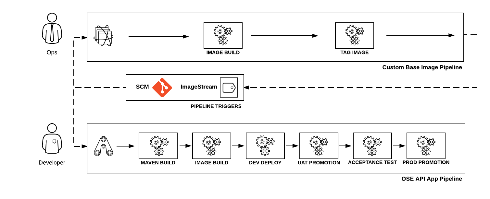

Red Hat Summit 2016 Enterprise CI/CD with OpenShift
==============================

This repository contains the material for building an Enterprise Continuous Integration and Continuous Delivery environment within [OpenShift](https://www.openshift.com/) and demonstrates common enterprise patterns for building and deploying containerized applications.


## Components

The following components are built into the OpenShift environment as containers

* [Jenkins](https://jenkins.io/)
* [Nexus](http://www.sonatype.org/nexus/)
* [Gogs](https://gogs.io/)
* [PostgreSQL](https://www.postgresql.org/)

## Prerequisites

This demo requires an OpenShift environment be available as a target runtime. In addition, access to the [OpenShift Command Line tool](https://access.redhat.com/downloads/content/290). 

## Demo Motivations

In many enterprise organizations that are working with Linux containers, application teams are not working with the direct upstream images that are provided from trusted sources. such as the Red Hat registry, and instead teams within the organization are providing a customized approved image beforehand. This allows for the application of necessary security and organizational requirements prior to developer usage. Being able to detect and react upon when upstream image changes occur is critical t the Continuous Integration and Continuous Delivery of both base and application images and ensures application teams are running with the most recent images. 

The goal is to demonstrate how tools commonly used within enterprises can be used to emphasize the concepts of Continuous Integration and Continuous delivery using OpenShift as a runtime platform for both infrastructure applications as well as applications created by development teams. 

In this example, an operations team creates a custom base docker image that enables the use of Wildfly Swarm applications for developers. These set of actions are modeled into an operations pipeline. An application team leveraging Wildfly Swarm applications utilizes the base image for the creation of their own containerized applications leveraging the Swarm framework. They have a typical application pipeline that is separated into multiple stages of functionality including the building of Java artifacts and promotion between logically separated environments within OpenShift.

## Building the Environment

The entire environment can be stood up by running the included `init.sh` script. By default, the script assumes the Red Hat Container Development Kit (CDK) will be the target environment with the default OpenShift master URL at `https://10.1.2.2:8443` and using the Administrative account. These values are specified at the top of the script in the following variables:

* OSE_CLI_HOST
* OSE_CLI_USER
* OSE_CLI_PASSWORD

Modify these variables to match the running target environment and once satisfied, execute the command `./init.sh` from within the repository

Once the setup is complete, you can navigate to the OpenShift web console to view the infrastructure components located in the *ci* project. Applications will not be available in the api-app-&lt;environment&gt; projects until a successful pipeline was completed end to end.

##  Default Credentials

The following credentials are configured by default as part of the installation and configuration process

* Jenkins: admin/password
* Nexus: admin/admin123
* gogs: gogs/osegogs


## Environment Overview

After the environment has been built successfully build and running, the following OpenShift projects are available 

* ci
	* Contains the set of Continuous Integration and Continuous Delivery components including Jenkins, Nexus, and Gogs
* custom-base-image
	* Builds a custom base Source to Image builder (S2I) image for running Wildfly Swarm applications
* api-app-dev
	* Development environment for the API application
* api-app-uat
	* User Acceptance Testing environment for the API application
 api-app-prod
	* Production environment for the API application

### Jenkins Jobs

Jenkins is used as the orchestration tool to facilitate the build and deployment pipeline. 




Included in Jenkins are the following jobs:

* custom-base-image-pipeline - Performs a build of a new Source to Image builder image and tags the newly created image for consumption by application teams
* custom-base-image-is-trigger - Triggers the custom-base-image-pipeline whenever a change occurs to the base OpenShift Source to Image builder
* ose-api-app-pipeline - Pipeline for building an application that queries the OpenShift API. the pipeline consists of building a Maven based Java application to be deployed as part of a Wildfly Swarm application. The pipeline is composed of automated build and deployments to a development and user acceptance testing environment as well as automated testing. A manual promotion process is performed by users to promote the application into a production environment. 
* ose-api-app-trigger - Triggers the ose-api-app-pipeline whenever a change occurs to the custom base image. 


## Running through the demo

To simulate the goal of the demonstration, we will make a change to the base image that will cause a rebuild of the base image and automatically trigger application teams pipelines. 

1. The first step is to clone the `custom-base-image` git repository from the included gogs server. Navigate to the OpenShift web console and select the **ci** project. Once inside the ci project, select the URL for the gogs route. 
2. Inside gogs, select the **explore** button at the top of the screen to list the available repositories and select the **custom-base-image** repository.
3. Locate the *http* based url for the repository that will be used to clone the repository
4. From your local machine, clone the *custom-base-image* repository

    ```    
    git clone <url>
    ```
5. Change into the cloned folder and locate the `Dockerfile` that is used to build the docker image. We will make a small addition that will add a new file to the base image. Add the following line just prior to the `USER` statement and save the changes once complete

    ```
    echo "Custom modification" > /opt/openshift/custom.txt
    ```
6. Commit the change and push the changes back to the git repository. Use the credentials found in the *Default Credentials* section above when promoted to push the changes

    ```
    git add Dockerfile
    git commit -m "Modification to the Dockerfile"
    git push origin master
    ```
7. This will trigger a new build of the *custom-base-image-pipeline*. Once complete, the tag is updated to refer to the newly created image
8. Once the tag has been updated, Jenkins monitors ImageStream for the `custom-base-image` and once a change is detected, the *ose-api-app-trigger* job is triggered which in turn will trigger the *ose-api-app-pipeline* job
9. Application pipeline will build the java artifact using maven, package and deploy the artifact to the nexus server. A new Source to Image build in OpenShift will be triggered using the artifacts from the maven build. Once the build completes, the newly created image will be deployed to the development environment (api-app-dev)
10. An automated promotion to the user acceptance testing environment will then occur (api-app-uat) followed by acceptance testing to validate successful functionality of the application.
11. Before a promotion to the production environment occurs, a manual promotion process must be initiated. Navigate to the running *ose-api-app-pipeline* job and select the **Paused for Input** link on the lefthand side of the page. Select the **Proceed** button to promote the application to the production environment. 